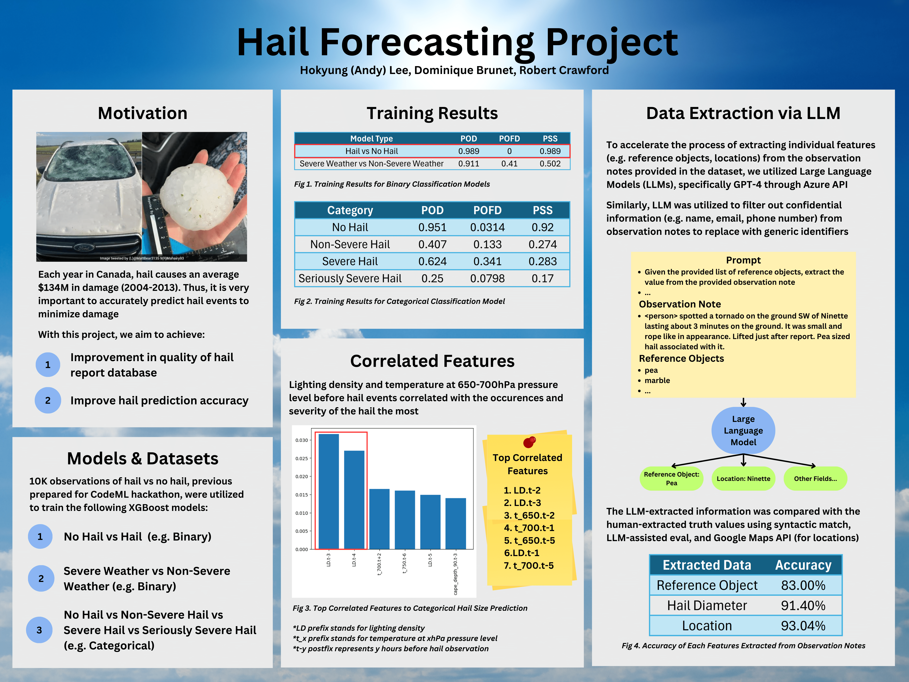

# Hail Forecasting Project

- Repository for notebooks and documentations for the Hail Forecasting project by Hokyung (Andy) Lee.
- All notebooks, datasets, and media are also stored at [Hail Forecasting Google Drive](https://drive.google.com/drive/folders/16GGzYDVq0jk0u-SIMPEqogPL_vfpmtD_?usp=drive_link).
- If you do not have access to the folder, please send an email at `techandy42@gmail.com` or `dominique.brunet@ec.gc.ca` to gain access.

### About

- `/datasets` contains info about hail datasets.
- `/notebooks` contains Colab notebooks for training XGBoost models and extracting/validating/filtering info from hail observation notes using LLMs.
- `/web_scrapped_images` contains info about collected social media screenshots.
- `/web_scrapping_scripts` contains Python script to screenshot social media links from hail observation notes.
- `/data_entry_scripts` contains Python script to automatically submit Severe Weather Report Form.
